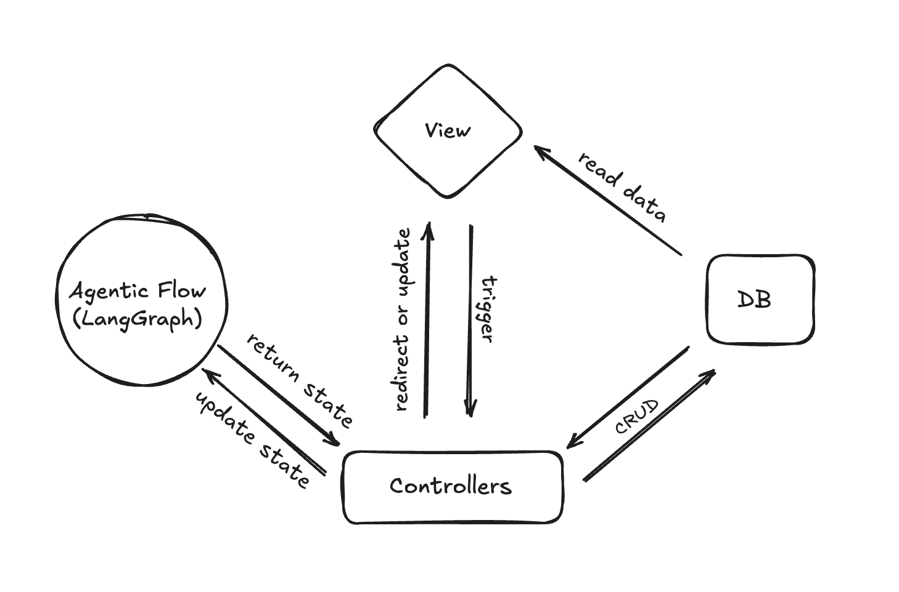

# AI_README_Generator

AI_README_Generator is an AI-powered tool that automates GitHub repository analysis to create comprehensive README documentation.

This project leverages various technologies such as LangChain, LangGraph, FastHTML, ColBERT, tree-sitter parsers, and advanced semantic analysis to provide meaningful insights into repository contents. By orchestrating multi-step processes that seek confirmation from users, it not only refines results iteratively but also collects a self-evaluation dataset used to improve the system.

Currently, the system only supports Python projects, but there are plans to expand support to other languages.

## System Architecture Flow



## Features
### 1. **Cognitive Architecture for Agents with LangGraph**

- The system is designed using a graph-based cognitive architecture using LangGraph.

### 2. **Code Retrieval**

- The system utilizes **ColBERT**, a neural information retrieval model based on cross encoder, to perform context-aware retrieval of documents and code snippets within the repository. This ensures that the most relevant information is identified and utilized for analysis and README generation.

### 3. Smart Chunking

- By using **tree-sitter** parsers, the system chunk codes into semantically meaningful parts. Also, it implements “smart chunking” which includes relevant part of code such as class definition or function arguments to parts of code that doesn’t include them.

### 4. **Human-in-the-Loop Feedback System**

- A key feature of AI_README_Generator is the integration of human feedback. Users can refine the system's output iteratively, improving the relevance and accuracy of the generated documentation.

### 5. **Web Interface for User Interaction**

- A user-friendly web interface built with FastHTML allows users to input GitHub repository URLs for analysis. The system then analyzes the repository and presents the results, potentially generating a README file or other types of documentation. The feedback system enables an iterative process where users can provide feedback on the analysis, guiding the system to refine and improve its results over time.

## How It Works

1. **User Inputs GitHub Repository URL**: The user provides a GitHub repository URL via the web interface.
2. **Clone the repository and generate metadata:** The system creates project metadata, including the directory tree and a list of packages used in the project.
3. **Smart chunking and indexing with ColBERT:** The system chunks codes and index them for ColBERT analysis. 
4. **Feedback and Refinement**:The system analyzes the repository using predefined steps of instruction. For instance, the first instruction might be "What are the core Python packages?" The system then retrieves relevant code snippets and generates an answer to the question. Using the web application, the user can confirm or correct this analysis.
5. **README Generation**: Based on the analyzed content, the system may generate a README content that explain the repository's purpose, usage, and key components.

## Technologies Used

- **LangChain/LangGraph**: Orchestrates the agentic flow for code retrieval, analysis, and documentation generation.
- **FastHTML**: Web development with python.
- **ColBERT(RAGatouille)**: A neural information retrieval model that enhances context-aware code retrieval.
- **Tree-sitter**: Provides language-specific parsing capabilities for multi-language support.

## How to run

```bash
# Install required packages
pip install -r requirements.txt

# Run the application
python main.py
```
